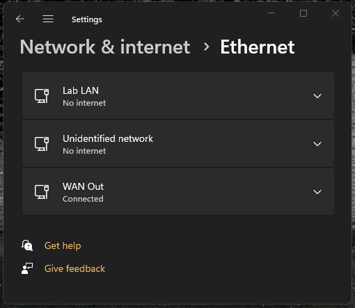

# PowerShellTool
A tool which uses PowerShell to provide analysis-level details about different parts of Windows 

### Example
```
.\PowerShellTool.ps1 -logFileOnly -logFile '.\Network-Details.txt' -getNetworkAdapterInfo -adapterName 'Network' -adapterDriverInfo
```

### Getting Network Connection Information
```
PS D:\Code\PowerShell\PowerShellTool> .\PowerShellTool.ps1 -getNetworkConnections -netAddress 0.0.0.0 -netProtocol TCP -netGetServiceNames -netServiceName 'Encrypting File System (EFS)'
Getting TCP Connections
Getting Services
Sorting data

Matches Protocol LocalAddress LocalPort RemoteAddress RemotePort  State ProcessName ProcessId Services
------- -------- ------------ --------- ------------- ----------  ----- ----------- --------- --------
      3 TCP      0.0.0.0          49664 0.0.0.0                0 Listen lsass            1076 Encrypting File System (EFS), CNG Key Isolation, Security Accounts Manager, Credential Manager


```

### Help Output
[Get-Help .\PowerShellTool.ps1](./media/help-output.log)

### Command Documentation
[Overview of PowerShellTool](./media/overview.md)

## Renaming Network Profiles

```
> .\PowerShellTool.ps1 -renameNetworkProfile -npName "Network" -npNameNew "WAN Out"  -npDescNew "Public Internet Connection"
> .\PowerShellTool.ps1 -renameNetworkProfile -npName "Network 2" -npNameNew "LAb LAN"  -npDescNew "Private Internet Connection"
```
### Note: After the command:
- Disable and re-enable the network adapter for the changes
- Have not tried just using `ipconfig /renew` with it yet

```
Type Tree 
Get-NetAdapter
    Get-WmiObject -Class Win32_NetworkAdapter
        Get-CimInstance -ClassName Win32_NetworkAdapter
        Get-NetIPAddress
        Get-NetRoute
        Get-DriverInfo

Get-DriverInfo
    Get-INFData
        Get-Perms
        Get-AuthenticodeSignature
        Get-PnpDevice -InstanceId
        CrossReference-DeviceIDs
        Get-Service
```